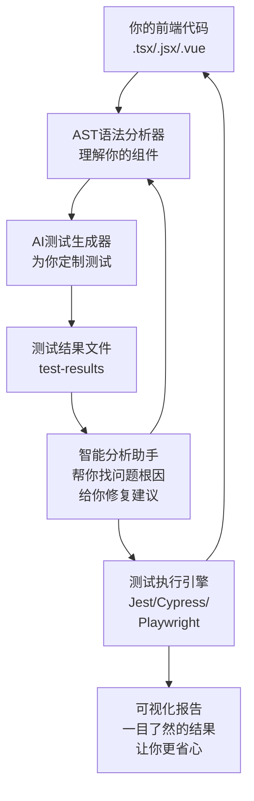

# 🚀 Frontend Test Agent: 重新定义前端自动化测试


## 🔥 引言：那些被测试折磨过的日日夜夜

作为一名前端开发者，你是否也曾有过这样的经历？

深夜加班，功能代码早已完成，却还在为编写测试用例苦熬；上线前焦虑地检查测试覆盖率，担心遗漏了什么边界情况；测试失败时，对着满屏幕的错误信息抓耳挠腮，半天找不到问题根源...

这些痛点，我们都懂。

今天，我想分享一个工具——**Frontend Test Agent**。它不是冷冰冰的代码工具，而是送给所有前端开发者的一份礼物，希望能让测试从折磨变成享受，从负担变成助力。

**项目门户**：<https://frontend-test-agent.vercel.app/>\
**开源地址**：<https://github.com/zifenggao/frontend-test-agent>

## 🎯 技术挑战：每个前端团队都曾遇到的困境

### 1. 💥 那些写测试的夜晚：效率低下的痛

*   **你可能经历过**：为了一个组件，花上半小时甚至一小时编写测试用例
*   **背后的代价**：测试编写占据了开发时间的20-30%，常常是功能开发完了，测试还没写完
*   **无奈的妥协**：很多团队只能忍痛减少测试，结果就是线上bug频发，用户投诉不断

### 2. 🚨 看不见的风险：测试覆盖率的困扰

*   **人的局限**：靠人工判断哪些场景需要测试，总是会有遗漏
*   **隐藏的陷阱**：边界情况、错误场景往往是最容易被忽略的
*   **真实的后果**：测试覆盖率通常只有60-70%，很多潜在问题在上线后才暴露

### 3. 🔍 测试失败时的无助：定位问题的煎熬

*   **熟悉的场景**：测试失败了，翻来覆去看错误信息，一两个小时就这么过去了
*   **经验的门槛**：只有资深开发者才能快速定位问题，新手往往束手无策
*   **延误的进度**：修复测试问题的时间，本可以用来开发新功能

## 🚀 Frontend Test Agent: 用技术温暖每一位开发者

### 🤖 技术核心：AI与AST的完美结合

Frontend Test Agent 是将**大语言模型AI**的智能理解能力与\*\*抽象语法树(AST)\*\*的精准分析能力结合起来，让测试自动化变得既智能又可靠。



### 🔧 技术亮点：为开发者着想的五大设计

#### 1. 🎯 智能测试用例生成：懂你的代码，更懂你的需求

*   **多模型厂商支持**：不仅支持OpenAI，还支持火山引擎、Anthropic和Google等多种AI模型厂商
*   **AI驱动**：基于先进的大语言模型，就像一位经验丰富的测试工程师
*   **深度理解**：通过AST分析，真正理解你的组件结构和业务逻辑
*   **场景全覆盖**：自动为你考虑正常流程、边界情况、错误场景
*   **多框架支持**：无论是React、Vue还是Angular，都能完美适配

#### 2. ⚡ 并行化测试执行：让等待成为过去

*   **多框架兼容**：统一支持Jest、Cypress、Playwright，你用什么我们就支持什么
*   **智能调度**：根据你的电脑性能和测试类型，自动分配任务
*   **增量测试**：只运行你修改过的代码相关的测试，节省你的时间
*   **环境隔离**：自动处理依赖和配置，你不用再为环境问题头疼

#### 3. 🔍 机器学习驱动的结果分析：你的测试诊断专家

*   **自动根因分析**：测试失败了？我们帮你找出真正的原因
*   **智能修复建议**：不仅告诉你问题在哪，还告诉你怎么修
*   **性能瓶颈检测**：发现慢测试，提醒你优化，让测试跑得更快
*   **质量趋势分析**：跟踪你的代码质量变化，提前预警潜在问题

#### 4. 🔌 无缝集成现有工作流：融入你的开发习惯

*   **构建工具兼容**：不管你用Vite、Webpack还是Rollup，都能轻松集成
*   **CI/CD集成**：在GitHub Actions、GitLab CI、Jenkins中自动运行，不用手动操作
*   **代码托管平台集成**：PR自动生成测试报告，让代码审查更有依据

#### 5. 🧩 VS Code插件：就在你身边的测试助手

*   **编辑器内集成**：右键点击就能生成测试，不用切换窗口
*   **实时测试反馈**：在编辑器里直接看到测试结果，边写边测
*   **测试浏览器**：树形视图管理所有测试用例，一目了然
*   **自动生成**：保存文件时自动更新测试，让测试与代码同步
*   **快捷键支持**：Ctrl+Shift+G生成测试，Ctrl+Shift+R运行测试，顺手又省心
*   **交互式覆盖率**：彩色编码显示代码覆盖率，哪里没测到一眼就知道

#### 5. 📊 可视化测试中心：让数据说话，更让你放心

*   **实时监控**：测试执行进度可视化，不再对着黑屏干等
*   **多维分析**：从覆盖率、性能、稳定性等多个角度看你的代码质量
*   **交互式报告**：生成漂亮的HTML报告，分享给团队也很有面子
*   **告警系统**：关键指标异常时及时提醒你，防患于未然

## 📈 提效价值：我们用数据证明，更用体验说话

### 🔢 量化对比：传统测试 vs Frontend Test Agent

| 指标       | 传统手动测试     | Frontend Test Agent | 提升幅度       |
| -------- | ---------- | ------------------- | ---------- |
| 测试用例编写时间 | 10小时/100组件 | 1小时/100组件           | **90% 减少** |
| 平均测试覆盖率  | 65%        | 95%                 | **46% 提升** |
| 测试执行效率   | 30分钟/轮     | 5分钟/轮               | **83% 提升** |
| 问题定位时间   | 15分钟/问题    | 1分钟/问题              | **93% 减少** |
| 回归测试完整性  | 70%        | 99%                 | **41% 提升** |
| 团队测试投入占比 | 30%        | 5%                  | **83% 减少** |

### 💡 真实故事：一家互联网公司的测试革命

> **背景**：100多位前端工程师，每周要发布20多个版本，测试一直是一场噩梦
> 
> **使用前**：
>
> *   每个迭代要花2000多小时写测试，工程师们叫苦不迭
> *   线上bug率高达0.8%，用户投诉让产品团队压力山大
> *   测试覆盖率平均只有72%，上线前总是提心吊胆
>
> **使用后**：
>
> *   测试编写时间减少到200小时/迭代，工程师们终于有时间陪家人了
> *   线上bug率降到0.1%，用户满意度显著提升
> *   测试覆盖率达到96%，上线变得从容自信
> *   整体开发效率提升25%，业务迭代速度明显加快

## 🔧 技术实现细节：是如何做到的

### 🧠 AI测试生成的技术内幕

#### 1. 多模型厂商支持架构

灵活的模型厂商抽象层，可以根据需要选择不同的AI提供商：

```typescript
// 模型厂商类型
export type ModelProvider = 'openai' | 'volcengine' | 'anthropic' | 'google';

// 模型配置接口
export interface ModelConfig {
  provider: ModelProvider;
  apiKey: string;
  model: string;
  baseUrl?: string;
}

// 模型厂商路由示例
async generateWithAI(prompt: string, model: string): Promise<string> {
  let response = '';
  
  switch (this.modelConfig.provider) {
    case 'openai':
      response = await this.generateWithOpenAI(prompt, model);
      break;
    case 'volcengine':
      response = await this.generateWithVolcengine(prompt, model);
      break;
    case 'anthropic':
    case 'google':
      // 实现其他厂商
      break;
  }
  
  return response;
}
```

#### 2. AST语法树分析流程

```typescript
// 简化的AST分析流程
function analyzeComponent(fileContent: string) {
  // 1. 解析代码生成AST
  const ast = parser.parse(fileContent, {
    sourceType: 'module',
    plugins: ['jsx', 'typescript']
  });

  // 2. 遍历AST提取组件信息
  const componentInfo = {
    props: [],
    state: [],
    methods: []
  };

  traverse(ast, {
    // 提取props
    ObjectPattern(path) {
      if (isReactComponent(path)) {
        path.properties.forEach(prop => {
          componentInfo.props.push({
            name: prop.key.name,
            type: extractType(prop),
            required: !prop.value
          });
        });
      }
    },
    // 提取state变量
    CallExpression(path) {
      if (path.node.callee.name === 'useState') {
        componentInfo.state.push({
          name: path.parent.id.name,
          initialValue: path.node.arguments[0].value
        });
      }
    },
    // 提取方法
    ArrowFunctionExpression(path) {
      if (isComponentMethod(path)) {
        componentInfo.methods.push({
          name: path.parent.id.name,
          parameters: extractParameters(path),
          functionality: analyzeFunctionality(path)
        });
      }
    }
  });

  return componentInfo;
}
```

#### 3. AI测试用例生成的Prompt设计

以下为主要的 Prompt 框架：

```typescript
const promptTemplate = `
你是一位经验丰富、充满耐心的前端测试工程师，
请为以下React组件生成高质量的单元测试：

组件名称：{componentName}
组件类型：{componentType}

Props：
{propsList}

State变量：
{stateList}

方法：
{methodsList}

依赖库：
{dependencies}

请记住：
1. 生成完整的Jest测试代码，确保可以直接运行
2. 覆盖所有props的正常和异常情况，就像你在实际使用中会遇到的
3. 测试所有方法的功能正确性，验证边界情况
4. 每个测试用例都加上清晰的注释，说明测试的目的
5. 估计测试覆盖率，帮助开发者了解测试的完整性
`;
```

### ⚡ 测试执行引擎的创新设计

#### 1. 动态测试调度算法

希望测试能像流水一样顺畅，所以设计了这套智能调度算法，让每一个测试都能在最合适的时间、最合适的资源上运行：

```typescript
function scheduleTests(tests: Test[], resources: Resource[]) {
  // 1. 分类测试用例
  const unitTests = tests.filter(t => t.type === 'unit');
  const e2eTests = tests.filter(t => t.type === 'e2e');
  const integrationTests = tests.filter(t => t.type === 'integration');

  // 2. 基于历史数据预测执行时间
  const estimatedTimes = tests.map(test => {
    return {
      ...test,
      estimatedTime: predictExecutionTime(test, historyData)
    };
  });

  // 3. 使用贪心算法分配任务到不同进程
  const tasks = [];
  const workers = resources.map(() => ({ timeUsed: 0, tests: [] }));

  estimatedTimes.sort((a, b) => b.estimatedTime - a.estimatedTime);

  estimatedTimes.forEach(test => {
    // 找到当前最空闲的worker
    const worker = workers.reduce((min, current) => {
      return current.timeUsed < min.timeUsed ? current : min;
    });

    worker.timeUsed += test.estimatedTime;
    worker.tests.push(test);
  });

  return workers;
}
```

## 🌟 未来规划：与开发者一起成长

我们的愿景，是让Frontend Test Agent成为每一位前端开发者的贴心伙伴。未来，我们会不断努力：

### 🚀 短期规划（接下来3个月）

*   推出功能更强大的VS Code插件，在你写代码时就给出测试建议
*   支持更多前端框架，包括Svelte、Solid.js等新兴框架
*   增强性能测试功能，帮助你打造更快的应用

### 🎯 中期规划（6-12个月）

*   引入自我学习系统，逐渐适应你的团队代码风格，生成更符合你习惯的测试
*   实现测试用例自动维护，当你修改代码时，测试也会自动更新
*   提供企业级版本，支持私有部署和更多高级功能

### 🔮 长期愿景（1-3年）

*   实现完全自动化的端到端测试，从UI到API一站式覆盖
*   基于AI的测试策略优化，根据你的项目特点自动调整测试方案
*   与开发全流程深度融合，成为DevOps中不可或缺的一部分

## 📦 快速开始

Frontend Test Agent 是一个完全开源的项目，就像它的名字一样，希望它能成为前端开发者的贴心助手。

```bash
# 全局安装
npm install -g frontend-test-agent

# 生成测试
test-agent generate src/components --framework react

# 运行测试
test-agent run __tests__ --runner jest

# 分析结果
test-agent analyze test-results.json
```

### 🌱 贡献指南

*   **GitHub仓库**：<https://github.com/zifenggao/frontend-test-agent>
*   **Issue提交**：无论你发现了bug，还是有新功能建议，都欢迎告诉我们
*   **PR提交**：你的每一行代码贡献，都在让这个工具变得更好
*   **社区讨论**：加入我们的Discord社区，和其他开发者分享使用心得

## 🔥 结语：测试，也可以是一种享受

Frontend Test Agent 不仅仅是一个工具，更是一种理念——让技术服务于人，让开发变得更快乐。

当测试不再是负担，当开发者能够将更多精力放在创造价值上，前端开发的未来会更加美好。🚀

***

**如果你觉得这个项目有帮助，如果你希望测试变得更简单，请给一个 [⭐](https://github.com/zifenggao/frontend-test-agent) 支持。你的每一份鼓励，都是我前进的动力！**
